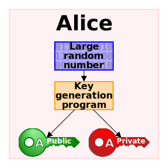
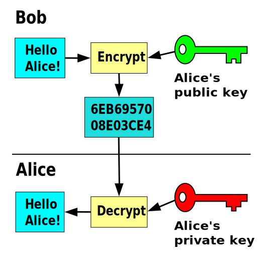
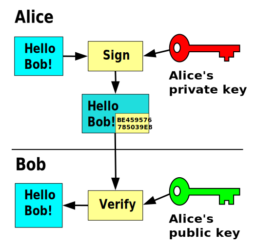

# Criptografia Assimétrica

1. [Conceito](#criptografia-assimétrica)
1. [Cifragem com chave Assimétrica](#enviando-mensagem-cifrada-com-criptografia-de-chave-pública)
1. [Assinatura Digital](#assinatura-digital)

Também conhecida como criptografia de chave pública, essa forma de criptografia utiliza um par de chaves (púbica e privada) para comunicação segura.

Figura: [Wikipedia, 2025](./../../imagens/README.md#public-key-crypto-1svg)

Pares de chaves para criptografia assimétrica são computados usando **funções** (matemáticas) **unidirecionais** (*one-way functions*). [^1]

Funções unidirecionais são funções fáceis de calcular em uma direção (dado `x`, calcular `f(x)`), porém computacionalmente inviáveis de inverter (dado `f(x)`, obter `x`). [^2]

**Para garantir a segurança dos algoritmos de criptografia assimétrica é importante que a chave privada não seja compartilhada.**

# Enviando mensagem cifrada com criptografia de chave pública

Figura: [Wikipedia, 2025](./../../imagens/README.md#public_key_encryptionsvg)

> Para enviar uma mensagem de forma confidencial para Alice, Bob precisa cifrar a mensagem usando a chave pública da Alice. Qualquer usuário que interceptar a a mensagem no meio do caminho, não conseguirá decifrá-la. A única chave que permitirá readquirir o conteúdo original da mensagem é a chave privada, qeu pertence somente à Alice e nunca foi compartilhada. 

# Assinatura digital 

Figura: [Wikipedia, 2025](./../../imagens/README.md#private_key_signingsvg)

> Alice pode usar sua chave privada para assinar um conteúdo, assim Bob poderá conferir se aquele **exato conteúdo** foi **enviado pela Alice**. [^3]

1. Alice assina o conteúdo original com sua chave privada.
1. Alice envia para Bob o conteúdo original juntamente com a assinatura gerada.
1. Bob recebe o conteúdo original e a assinatura gerada. 
1. Bob aplica sobre a assinatura gerada a chave pública de Alice, obtendo o conteúdo que gerou aquela assinatura. 
1. Bob compara o resultado encontrado na assinatura com o conteúdo original enviado pela Alice. 
1. Se os conteúdos forem iguais, aquele **exato conteúdo** foi **enviado pela Alice**.

Isso é possível pois a chave privada da Alice pertence somente a ela. Se outra chave tivesse assinado o conteúdo original, a comparação feita pelo Bob não teria sucesso.  

---

[^1]: [en.wikipedia.org/wiki/Public-key_cryptography](https://en.wikipedia.org/wiki/Public-key_cryptography#:~:text=Key%20pairs%20are%20generated%20with%20cryptographic%20algorithms%20based%20on%20mathematical%20problems%20termed%20one%2Dway%20functions.)
[^2]: *Hashes* são exemplos de uma classe de funções unidirecionais. 