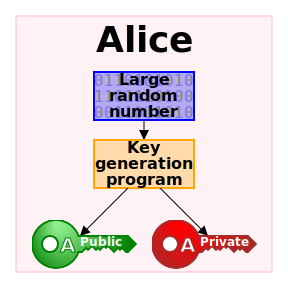
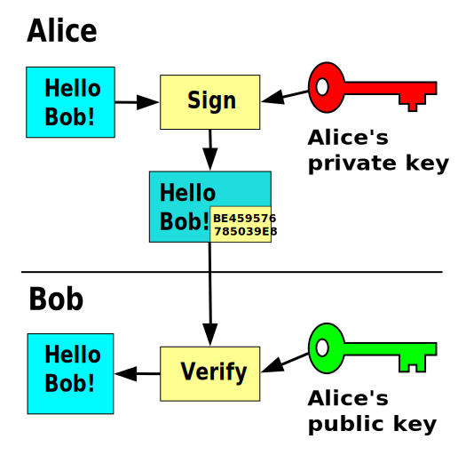

# Reference for all images on this website

## Public-key-crypto-1.svg

<b>Figura: </b>Par de chaves criptografia assimétrica

| From page | 
|:---- | 
| [en.wikipedia.org/wiki/Public-key_cryptography](https://en.wikipedia.org/wiki/Public-key_cryptography) |
| **Direct url** | 
| [upload.wikimedia.org/wikipedia/commons/3/32/Public-key-crypto-1.svg](https://upload.wikimedia.org/wikipedia/commons/3/32/Public-key-crypto-1.svg)| 

## Public_key_encryption.svg

<b>Figura: </b>Cifragem usando public key

| From page | 
|:---- | 
| [en.wikipedia.org/wiki/Public-key_cryptography](https://en.wikipedia.org/wiki/Public-key_cryptography) |
| **Direct url** | 
| [upload.wikimedia.org/wikipedia/commons/f/f9/Public_key_encryption.svg](https://upload.wikimedia.org/wikipedia/commons/f/f9/Public_key_encryption.svg) |

## Private_key_signing.svg

<b>Figura: </b>Assinatura usando chave assimétrica

| From page | 
| :-------- |
| [en.wikipedia.org/wiki/Public-key_cryptography](https://en.wikipedia.org/wiki/Public-key_cryptography) | 
| **Direct url**| 
| [upload.wikimedia.org/wikipedia/commons/7/78/Private_key_signing.svg](https://upload.wikimedia.org/wikipedia/commons/7/78/Private_key_signing.svg) | 

